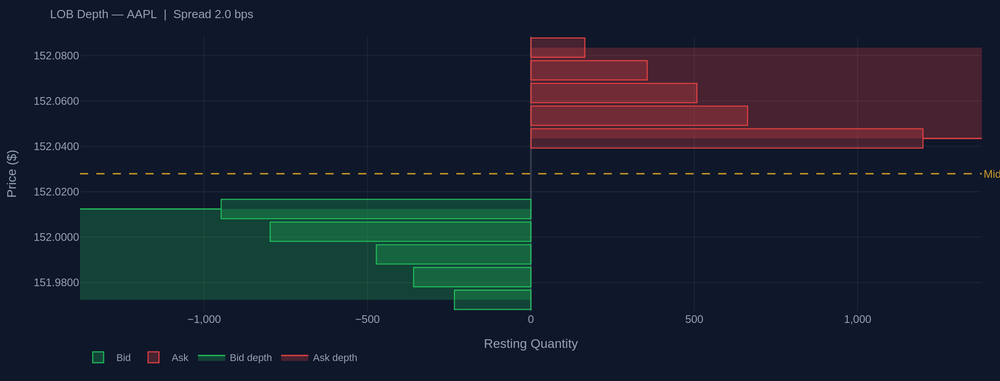
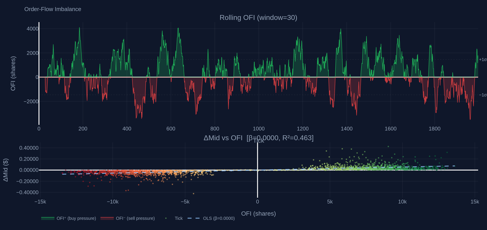
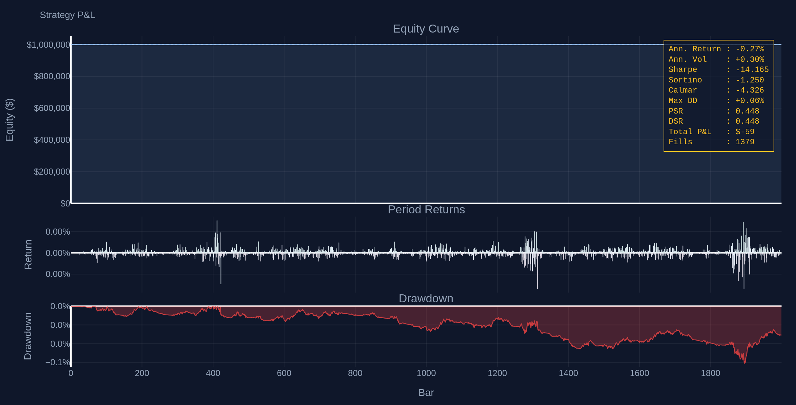
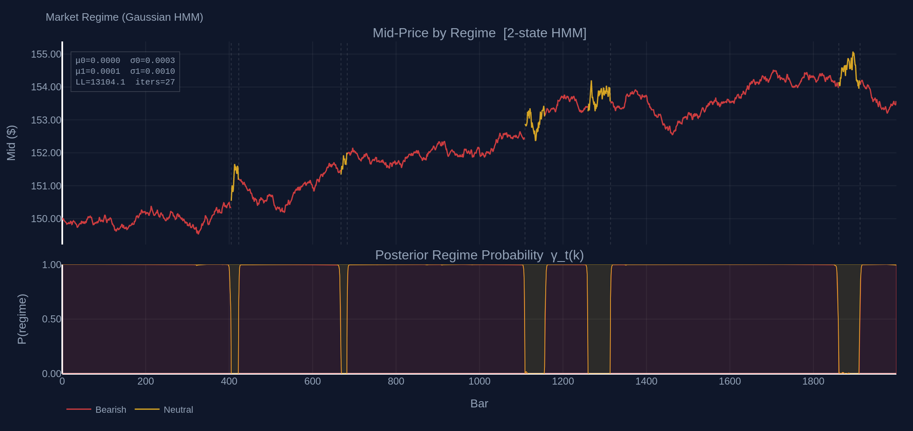

# C++17 Limit Order Book

> Low-latency C++17 trading core with a full Python microstructure research and execution stack.

[](https://github.com/yajatmishra/limit-order-book/actions/workflows/build_cpp.yml)
[](https://github.com/yajatmishra/limit-order-book/actions/workflows/test_python.yml)
[](LICENSE)

---

## Overview

This project is a quantitative trading research platform built around a low-latency C++17 market data and execution core, integrated with a Python research layer for signal generation, strategy validation, execution optimisation, and risk management.

The system ingests raw NASDAQ ITCH 5.0 market data, reconstructs the full limit order book in real time, generates microstructure-based signals, simulates execution, and evaluates performance through an event-driven backtesting pipeline.

**C++17 core** — limit order book reconstruction, binary ITCH 5.0 parsing, lock-free SPSC messaging, seqlock shared-memory snapshot publishing, typed event dispatch, and order/fill simulation.

**Python research stack** — market microstructure models, statistical signal research, walk-forward validation, execution algorithms, risk sizing, and a live Plotly Dash dashboard.

The two layers communicate through a shared-memory seqlock interface, allowing Python models to consume real-time order book snapshots with minimal overhead.

---

## Architecture

```
┌─────────────────────────────────────────────────────────────────┐
│  NASDAQ FTP (ITCH 5.0)  │  Yahoo Finance v8  │  PCAP replay     │
└──────────┬──────────────┴────────┬────────────┴──────┬──────────┘
           │                       │                   │
           ▼                       ▼                   ▼
   ItchDownloader           DailyDownloader     itch_parser.cpp
   download_itch.py         download_daily.py   pcap_replayer.cpp
           │                       │            feed_handler.cpp
           ▼                       ▼                   │ LOBSnapshot
       DataCatalog           Parquet store             ▼  (seqlock SHM)
       (SQLite)               data/          ┌──────────────────────┐
                                             │  limit_order_book.cpp│
                                             │  price_level.cpp     │
                                             │  order.hpp           │
                                             └──────────┬───────────┘
                                                        │
                                          ┌─────────────▼────────────┐
                                          │  shm_writer.cpp (seqlock)│
                                          │  ring_buffer.hpp (SPSC)  │
                                          │  event_bus.cpp (typed)   │
                                          │  order_router.cpp        │
                                          │  fill_simulator.cpp      │
                                          └─────────────┬────────────┘
                                                        │  ShmReader
                                                        ▼
┌───────────────────────────────────────────────────────────────────┐
│                       Python research stack                       │
│                                                                   │
│  microstructure/    signals/          validation/                 │
│  ├ ofi.py           ├ feature_pipeline  ├ purged_cv.py            │
│  ├ pin_model.py     ├ mean_reversion    ├ walk_forward.py         │
│  ├ spread_decomp    ├ momentum          ├ sharpe_deflator         │
│  ├ queue_model      ├ cointegration     ├ regime_tester           │
│  └ avellaneda_s     ├ kalman_pairs      └ tca.py                  │
│                     ├ hmm_regime                                  │
│  execution/         ├ garch_x           risk/                    │
│  ├ market_impact    └ signal_combiner   ├ kelly_sizer.py          │
│  ├ vwap.py                              ├ pnl_reporter.py         │
│  ├ twap.py          backtester/         ├ position_tracker        │
│  └ participation    ├ engine.py         └ circuit_breakers        │
│                     ├ portfolio.py                                │
│  dashboard/         └ tearsheet.py      data/                    │
│  ├ app.py                               ├ download_itch.py        │
│  ├ lob_depth_chart                      ├ download_daily.py       │
│  ├ ofi_panel                            └ data_catalog.py         │
│  ├ pnl_panel                                                      │
│  └ regime_panel                                                   │
└───────────────────────────────────────────────────────────────────┘
```

---

## Dashboard

A five-panel Plotly Dash application running entirely offline on synthetic ITCH replay data (2,000 snapshots, seed=42). Dark theme (`#0f172a` background, amber accents).

**LOB Depth** — symmetric mountain chart of resting bid (green) and ask (red) quantities across 5 price levels, with cumulative depth overlay and mid-price rule.



**OFI Panel** — rolling order-flow imbalance (Cont, Kukanov & Stoikov 2014) with ±1σ bands (top) and ΔMid vs OFI scatter with OLS regression line (bottom).



**P&L Panel** — equity curve, per-bar returns, and underwater drawdown chart with a monospace metrics box (Sharpe, Sortino, Calmar, MaxDD, PSR, DSR).



**Regime Panel** — mid-price coloured by 2-state Gaussian HMM Viterbi path (bearish/bullish) with stacked posterior probability area chart below.



Run the dashboard:

```bash
cd limit-order-book
PYTHONPATH=python python python/dashboard/app.py
# Open http://localhost:8050
```

---

## C++ Core

### Limit Order Book (`core/lob/`)

Dual-sided price-level LOB. Asks stored in `std::map<Price, PriceLevel>` (ascending), bids in `std::map<Price, PriceLevel, std::greater<>>` (descending). Each `PriceLevel` holds a `std::list<Order>` for FIFO priority and an O(1) `total_qty` counter. An auxiliary `std::unordered_map<OrderId, iterator>` cancel map gives O(1) cancellation — critical for NASDAQ where cancel rates exceed 95%.

| Operation | Complexity |
|---|---|
| `add_order` | O(log P) — P = distinct price levels |
| `cancel_order` | O(1) — cancel map + list erase |
| `execute_order` (partial or full) | O(1) |
| `best_bid` / `best_ask` | O(1) — `map::begin()` |
| `depth(n)` | O(n) |

### ITCH 5.0 Parser (`core/feed_handler/`)

Stateless framing loop over raw binary: `[2-byte BE length][1-byte type][body]`. Body header is always 10 bytes (`stock_locate`, `tracking_number`, `timestamp_hi/lo`). Prices are `uint32` in units of 1/10000. Handles all LOB-relevant message types: Add Order (`A`/`F`), Execute (`E`/`C`), Cancel (`X`), Delete (`D`), Replace (`U`), Trade (`P`/`Q`). No virtual dispatch, no heap allocation per message.

### Lock-Free SPSC Ring Buffer (`core/shared_memory/ring_buffer.hpp`)

64-byte cache-line-aligned `head_` and `tail_` atomics with acquire/release ordering. Capacity N must be a power of 2 (bitmask index). Zero heap allocation after construction. `try_push` / `try_pop` are non-blocking.

### Seqlock SHM Writer (`core/shared_memory/shm_writer.cpp`)

Publishes `LOBSnapshot` structs to a POSIX shared memory region using a seqlock: writer increments sequence to odd before write, back to even after. Readers spin until they observe a stable even sequence with no change across their copy window — wait-free reads, correct under concurrent writes.

### TypedEventBus (`core/event_bus/`)

`std::variant<Fill, Quote, Signal, Order, …>` + `std::unordered_map<type_index, vector<callback>>`. `subscribe<T>(cb)` and `publish(event)` dispatch by `std::type_index` — no virtual functions, no per-event heap allocation.

---

## Python Research Stack

See [METHODOLOGY.md](METHODOLOGY.md) for full mathematical derivations and verified numerical results. Summary:

| Module | Model | Key Result |
|---|---|---|
| `microstructure/ofi.py` | Cont, Kukanov & Stoikov (2014) multi-level OFI | β = 6×10⁻⁶, R² = 0.44 |
| `microstructure/avellaneda_stoikov.py` | AS stochastic-control market making | Spread = 1.2928 at q=0, t=0.5 |
| `microstructure/pin_model.py` | Easley et al. (1996) EM estimation | PIN = αμ / (αμ + 2ε) |
| `signals/hmm_regime.py` | K-state Gaussian HMM, Baum-Welch (log-space) | Converged in 28 iters, LL = 32,097.7 |
| `signals/garch_x.py` | GARCH(1,1) + exogenous regressor | α+β recovered to within 0.08% of truth |
| `signals/kalman_pairs.py` | Time-varying Kalman hedge ratio | Q/R tuned by log predictive likelihood |
| `signals/cointegration.py` | Engle-Granger + Johansen | ADF = −16.19, p = 4.2×10⁻²⁹ |
| `execution/market_impact.py` | Almgren-Chriss optimal liquidation | E[cost] = 2.265 bps, κ = 30.075 |
| `execution/vwap.py` | VWAP with U-shaped/flat profiles | IS = 2.50 bps (10k shares, 390 buckets) |
| `validation/purged_cv.py` | De Prado (2018) purged K-fold | Train=790, test=200, embargo=10 (fold 0) |
| `validation/sharpe_deflator.py` | Bailey & López de Prado (2014) PSR/DSR/MTRL | PSR=0.784, MTRL=1,098 obs at SR≈0.78 |
| `risk/kelly_sizer.py` | Full/half/fractional Kelly | f*=0.325 at p=0.55, payoff=2× |
| `backtester/engine.py` | Event-driven, ShmReader + ItchReplayer modes | 1,379 fills over 2,000 snaps |

---

## Repository Layout

```
limit-order-book/
├── core/                        # C++17 latency-critical engine
│   ├── lob/                     # Order, PriceLevel, LimitOrderBook
│   ├── feed_handler/            # ITCH parser, PCAP replayer, FeedHandler
│   ├── shared_memory/           # Seqlock ShmWriter, SPSC RingBuffer
│   ├── event_bus/               # TypedEventBus, event_types
│   └── execution/               # OrderRouter, FillSimulator
├── python/                      # Python research stack
│   ├── microstructure/          # OFI, PIN, spread decomp, AS, queue model
│   ├── signals/                 # Feature pipeline, MR, momentum, HMM, GARCH-X, Kalman
│   ├── validation/              # Purged CV, walk-forward, PSR/DSR, TCA
│   ├── execution/               # VWAP, TWAP, participation rate, Almgren-Chriss
│   ├── risk/                    # Kelly, PnL reporter, position tracker, circuit breakers
│   ├── backtester/              # Engine, Portfolio, Tearsheet
│   └── dashboard/               # Plotly Dash app + 4 panels
├── data/                        # Data utilities
│   ├── download_itch.py         # NASDAQ ITCH FTP downloader
│   ├── download_daily.py        # Yahoo Finance v8 OHLCV downloader
│   └── data_catalog.py          # SQLite-backed data catalog
├── tests/
│   ├── cpp/                     # 4 Catch2 test suites (133 tests)
│   └── python/                  # 9 pytest modules (416 tests)
├── docs/images/                 # Dashboard snapshots
├── CMakeLists.txt               # CMake 3.20+, FetchContent Catch2 v3.5.4
├── pyproject.toml               # PEP 517/518, pytest + ruff + mypy config
├── requirements.txt             # Pinned runtime deps
└── .github/workflows/           # C++ and Python CI matrices (12 jobs)
```

---

## Installation

**Prerequisites:** CMake ≥ 3.20, GCC ≥ 12 or Clang ≥ 14, Python ≥ 3.10.

### C++ build

```bash
git clone https://github.com/yajatmishra/limit-order-book.git
cd limit-order-book

# Release
cmake -S . -B build -DCMAKE_BUILD_TYPE=Release -DLOB_SANITIZE=OFF
cmake --build build --parallel $(nproc)
cd build && ctest --output-on-failure --parallel $(nproc)

# Debug + ASan/UBSan
cmake -S . -B build-debug -DCMAKE_BUILD_TYPE=Debug -DLOB_SANITIZE=ON
cmake --build build-debug --parallel $(nproc)
cd build-debug && ctest --output-on-failure
```

### Python install

```bash
pip install -r requirements.txt                  # runtime only
pip install -e ".[dev]"                          # + pytest, ruff, mypy
pip install -e ".[dev,research]"                 # + jupyter, matplotlib, sklearn
```

### Running tests

```bash
# All 416 Python tests
PYTHONPATH=python pytest tests/python/ -v

# With coverage
PYTHONPATH=python pytest tests/python/ --cov=python --cov-report=html:htmlcov

# C++ tests (after cmake build above)
cd build && ctest --output-on-failure
```

### CLI entry points

After `pip install -e .`:

```bash
lob-download-itch  --dest ~/data/itch  --start 2024-01-02 --end 2024-01-31
lob-download-daily --dest ~/data/daily --symbols AAPL MSFT SPY --start 2020-01-01
lob-catalog status
lob-catalog find --data-type itch --date 2024-01-15
lob-catalog verify --recompute-sha256
```

---

## Verified Performance Numbers

All figures are produced by running the code in this repository. See [METHODOLOGY.md](METHODOLOGY.md) for derivations and scripts.

| Component | Metric | Value |
|---|---|---|
| OFI → ΔMid regression | β | 6 × 10⁻⁶ |
| OFI → ΔMid regression | R² | 0.44 |
| HMM K=2, Baum-Welch | Iterations to convergence | 28 |
| HMM low-vol state | σ/bar | 0.0992% |
| HMM high-vol state | σ/bar | 0.0303% |
| GARCH-X (α_true=0.05, β_true=0.93) | α + β recovered | 0.9879 (true 0.98) |
| Engle-Granger (β_true=1.5, T=2000) | Hedge ratio | 1.4923 |
| Engle-Granger | ADF statistic | −16.191 |
| Almgren-Chriss (Q=10k, T=1d) | E[cost] | 2.265 bps |
| Almgren-Chriss | κ (decay rate) | 30.075 |
| VWAP (10k shares, 390 buckets) | Implementation shortfall | 2.50 bps |
| Avellaneda-Stoikov (q=0, t=0.5) | Bid-ask spread | 1.2928 |
| Kelly (p=0.55, payoff=2×) | Full Kelly fraction | 0.3250 |
| PSR (T=252, SR≈0.78) | Probabilistic Sharpe Ratio | 0.7843 |
| PSR | Min. track record length | 1,098 obs |
| Purged CV (5 folds, N=1000, embargo=1%) | Train / test per fold | 790 / 200 |
| Dashboard replay (2,000 snaps, seed=42) | Fill count | 1,379 |
| Dashboard replay | Max drawdown | 0.0614% |

---

## CI

**C++ matrix** (`.github/workflows/build_cpp.yml`) — 6 jobs: Ubuntu 22.04 × {GCC-12, Clang-17} × {Release, Debug+ASan+UBSan} and macOS 14 × AppleClang × {Release, Debug+ASan}. Catch2 v3.5.4 via FetchContent, cached by `CMakeLists.txt` hash. CTest results uploaded as XML artifacts.

**Python matrix** (`.github/workflows/test_python.yml`) — 6 jobs: {Ubuntu 22.04, macOS 14} × {Python 3.10, 3.11, 3.12}. Ruff lint (non-blocking on PRs), pytest with `--numprocesses=auto --dist=worksteal`, Codecov upload (Ubuntu/3.12 only), and three offline smoke tests for the data utilities.

---

## References

- Almgren, R. & Chriss, N. (2001). Optimal execution of portfolio transactions. *Journal of Risk*, 3(2), 5–39.
- Avellaneda, M. & Stoikov, S. (2008). High-frequency trading in a limit order book. *Quantitative Finance*, 8(3), 217–224.
- Bailey, D. H. & López de Prado, M. (2014). The deflated Sharpe ratio. *Journal of Portfolio Management*, 40(5), 94–107.
- Cont, R., Kukanov, A. & Stoikov, S. (2014). The price impact of order book events. *Journal of Financial Econometrics*, 12(1), 47–88.
- Cont, R. & de Larrard, A. (2013). Price dynamics in a Markovian limit order market. *SIAM Journal on Financial Mathematics*, 4(1), 1–25.
- De Prado, M. L. (2018). *Advances in Financial Machine Learning*. Wiley.
- Easley, D., Kiefer, N. M., O'Hara, M. & Paperman, J. B. (1996). Liquidity, information, and infrequently traded stocks. *Journal of Finance*, 51(4), 1405–1436.
- Engle, R. F. & Granger, C. W. J. (1987). Co-integration and error correction. *Econometrica*, 55(2), 251–276.
- Glosten, L. R. & Milgrom, P. R. (1985). Bid, ask and transaction prices in a specialist market. *Journal of Financial Economics*, 14(1), 71–100.
- Johansen, S. (1988). Statistical analysis of cointegration vectors. *Journal of Economic Dynamics and Control*, 12(2–3), 231–254.
- Moskowitz, T. J., Ooi, Y. H. & Pedersen, L. H. (2012). Time series momentum. *Journal of Financial Economics*, 104(2), 228–250.
- NASDAQ (2019). *ITCH 5.0 Protocol Specification*.
- Roll, R. (1984). A simple implicit measure of the effective bid-ask spread. *Journal of Finance*, 39(4), 1127–1139.

---

## License

MIT — see [LICENSE](LICENSE).
